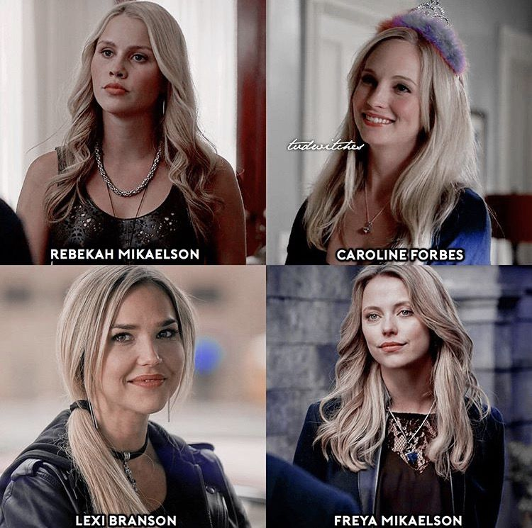

<!DOCTYPE html>
<html lang="en">

<head>
    <meta charset="UTF-8">
    <meta name="viewport" content="width=device-width, initial-scale=1.0">
    <title>Document</title>
    <link rel="stylesheet" href="tvd2.css">
</head>

<body>
    <h1>Vampire diaries</h1>
    
    
 The series is set in the fictional town of Mystic Falls, Virginia, a town charged with supernatural history. It
        follows thelife of Elena Gilbert (Nina Dobrev), a teenage girl who has just lost both parents in a car crash, as
        she fallsin love with a 161-year-old vampire named Stefan Salvatore (Paul Wesley), who she thinks is just a normal human. Their
        relationship becomes increasingly intricate as Stefan's mysterious older brother Damon Salvatore (Ian Somerhalder) returns to Mystic
        Falls with a plan to bring back their past love, Katherine Pierce, who is Elena's doppelgänger. Although Damon initially
        holds a grudge against his brother for forcing him to become a vampire, he later reconciles with Stefan and falls in love with
        Elena,creating a love triangle among the three. Both brothers attempt to protect Elena as they face various villains
        and threats to their town, including Katherine. The Salvatore brothers' pasts and the town's history along with
        its secrets are revealed through flashbacks as the series goes on.
    
  
     

        Additional storylines revolve around the other inhabitants of the town, most notably Elena's younger brother
        Jeremy Gilbert (Steven R. McQueen) and aunt Jenna Sommers (Sara Canning), her best friends Bonnie Bennett (Kat Graham) and
        Caroline Forbes (Candice King), their mutual friends Matt Donovan (Zach Roerig) and Tyler Lockwood (Michael Trevino), Matt's
        older sister Vicki Donovan (Kayla Ewell), and their history teacher, vampire hunter Alaric Saltzman (Matthew Davis). The
        town's politics are orchestrated by the Founders' council, comprising descendants of the founding families: the Fells, the
        Forbes,the Lockwoods, the Gilberts, and the Salvatores. They guard the town mainly from vampires and other supernatural
        threats such as werewolves, witches, hybrids (werewolf/vampire), and ghosts.
    

    <h2>Main Characters</h2>
    
        
        
ELENA GILBERT

        
        
STEFAN SALVATORE

        
        
DAMON SALVATORE

    
    <h2>Supporting Characters</h2>
    
        
Supporting Characters

        
 hello world

    

    
    
</body>

</html>
